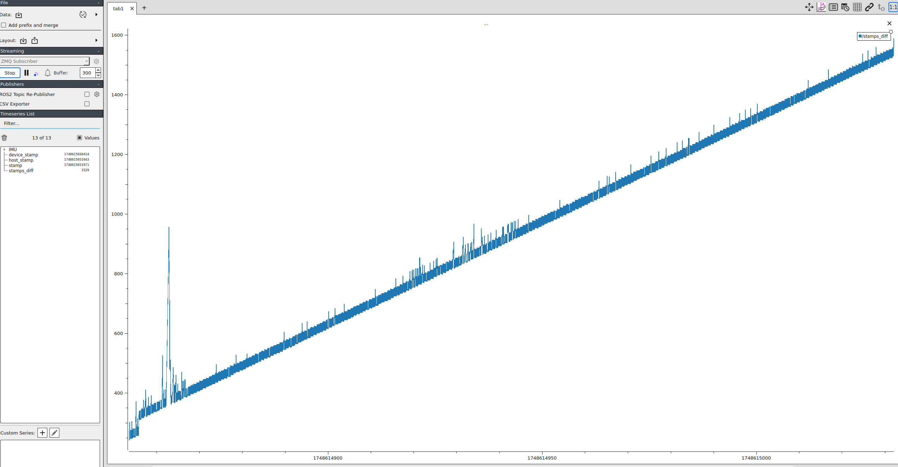
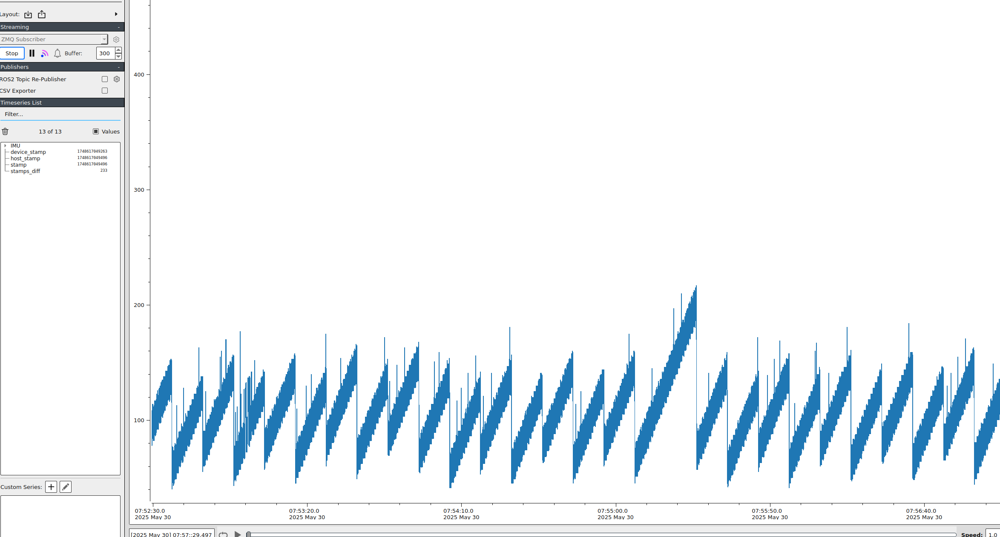
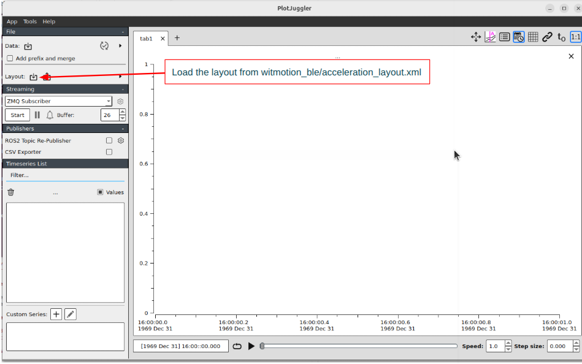

# WT901BLECL5.0 BLE Python Client

A Python library and command-line tool for scanning, connecting, and streaming data from WT901BLECL5.0 Bluetooth Low
Energy (BLE) Inertial Measurement Units (IMUs) and compatible sensors. This project enables real-time access to
orientation, acceleration, gyroscope, and other sensor data for applications in robotics, sports analytics, IoT, and
research.


## Features

- Scan for nearby WT901BLECL5.0 and compatible BLE IMU devices
- Connect to devices and manage BLE connections robustly
- Stream and decode sensor data (acceleration, angular velocity, orientation, quaternions, temperature, timestamp, etc.)
- Calibrate sensors (accelerometer, magnetometer)
- Synchronize device time with host
- Easily extensible and modular Python codebase

## Limitations
### Time Drift in WIT901BLECL5.0 During Bluetooth Streaming
When using the WIT901BLECL5.0 inertial sensor over Bluetooth, it's normal to observe a fixed offset between the device’s internal clock and the host system’s clock due to differences in clock initialization and hardware timing sources. However, an issue arises when this offset increases over time, indicating a time drift rather than a constant lag.

This unbounded drift is typically caused by clock mismatch between the host and the sensor. The device’s internal timer runs at a slightly different rate than the host clock, and because Bluetooth does not inherently provide strict synchronization or timestamp correction mechanisms, the host continues to accumulate timing error. Over long streaming sessions, even small frequency differences (e.g., in parts per million) can lead to significant drift.

In effect, without compensation, the timestamps associated with sensor data on the host become progressively inaccurate, misaligning data with other time-sensitive systems (e.g., cameras, other sensors).



### Synchronization
To address the issue, a background task was implemented to send a command to the device every 10 seconds, setting its internal timestamp to match the host system’s current time. This simple adjustment resulted in a significant improvement.

In the updated logs (synchronized.png), the timestamp difference no longer increased unboundedly. Instead, it was observed to fluctuate slightly between updates, remaining within a small, controlled range. Through this periodic synchronization, long-term drift was effectively eliminated, ensuring the data remained reliable over time.


## TODO
- Improve exception handling.
- Support all update rates. Currently only supports 20, 50, and 100 Hz.
- Only static accelerometer and spherical magnetometer calibration are supported.
- Currently only supports handling default packets (acceleration, angular velocity, orientation) and timestamp packets.
  It needs support for magnetometer, quaternions, temperature.

## Installation

1. **Clone this repository:**
   ```bash
   git clone git@github.com:ctroncozo/witmotion_ble.git
   cd witmotion_ble
   ```

2. **Install dependencies:**
   ```bash
   pip install -r requirements.txt
   ```
   Additional system dependencies (for `pynput` and BLE):
   ```bash
   sudo apt-get install python3-dev python3-pip python3-venv build-essential libevdev-dev
   ```

## Usage

### Scan for Devices

```bash
python scan.py
```

### Stream Data
Run the following command in a terminal:
```bash
python stream.py
```
- By default, the main application connects to a hardcoded MAC address (edit `app.py` to change).
- Press `q` to gracefully disconnect and stop streaming.

#### Visualization
Visualize data with plotjuggler https://github.com/facontidavide/PlotJuggler
* Load the following layout file: `acceleration_layout.xml`
* Select ZMQ TCP socket as data source
* Select the following socket: `tcp://localhost:5556`
* Press start


### Calibrate Sensors

Calibration routines are available in the `BleakClientWrapper` class. See `app.py` for usage examples.

## Code Structure

- `app.py` - Main entry point for connecting and streaming from a device
- `scan.py` - BLE device scanning utilities
- `client.py` - BLE client abstraction
- `wit/` - Protocol, message, and register definitions for WT901 sensors
- `viz.py` - (Optional) Visualization tools
- `calibrate.py` - (Optional) Calibration routines

## Device Addresses

- Example WT901BLECL5.0 MAC: `FC:7F:CD:6E:97:25`
- Example MetaMotionS MAC: `EE:33:49:03:91:45`

## References

- [WT901BLECL5.0 Data Sheet](resources/WT901BLECL_data_sheet.pdf)
- [WIT Standard Communication Protocol](resources/wit_standard_comm_protocol.pdf)

## License

MIT License

---
**Author:** Cristian Troncoso

For questions or contributions, please open an issue or contact the maintainer.